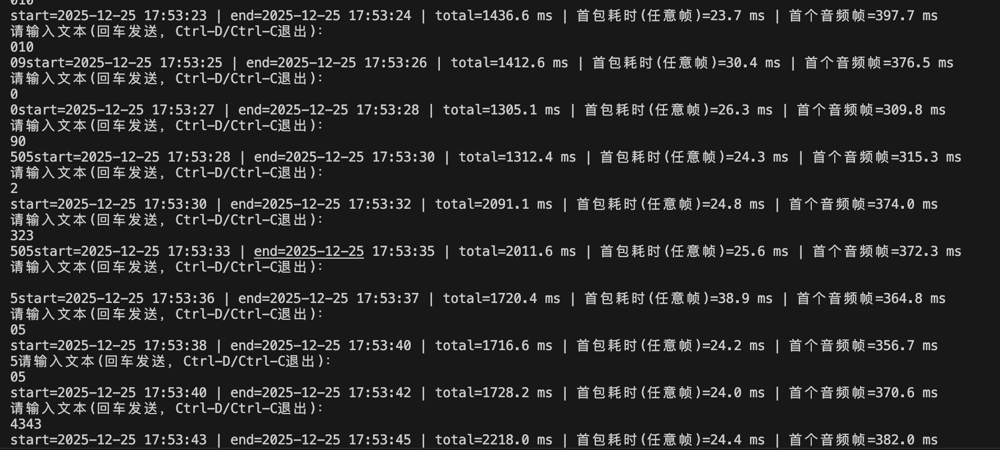

## CosyVoice 3 工程加速

模型按照官网准备

环境在h20 a100 4090上测试均可用

```
pip install -r requirements.txt
```



主要修改脚本见CosyVoice/cosyvoice/cli中

主要加速手段为添加各种cache以及缩短首帧长度

以及用于克隆的参考音频注意要把所有的静音和换气声全部换掉，防止合成的音频开头产生静音导致首帧变慢

启动模型,注意修改脚本中模型路径

```
python CosyVoice/vllm_example.py
```
